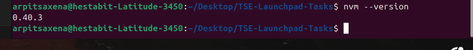
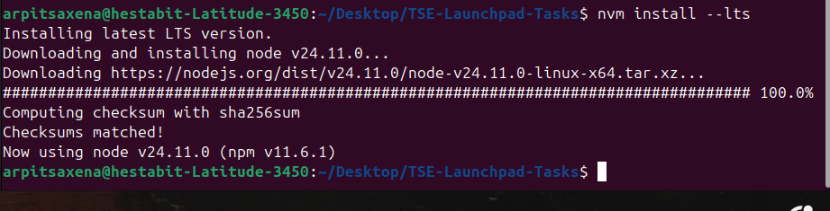
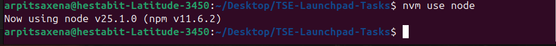
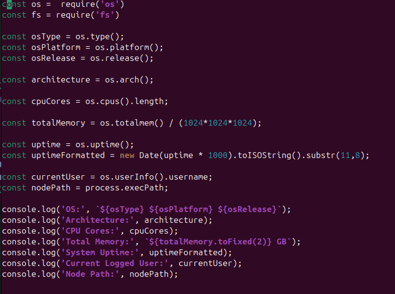
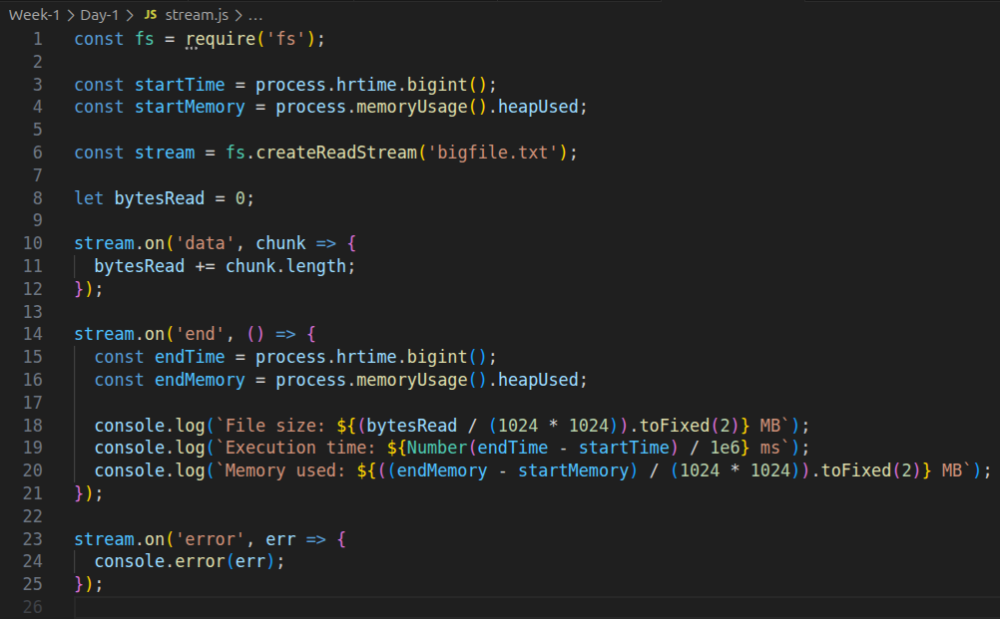

# DAY 1 — SYSTEM REVERSE ENGINEERING + NODE & TERMINAL MASTERING

## Learning outcomes
- Master terminal navigation and system inspection
- Deep understanding of PATH, environment variables, Node runtime

---

## Tasks (NO GUI — terminal only)

### 1) Identify & document (paste command + output)
Outputs to each command are pasted below.
- OS version-
    1. Using `cat /etc/os-release`
    - Output:
    2. Using `lsb_release –a`
    - Output:
    
    3. Using `hostnamectl`
    - Output : 
    
- Current shell
  - Command: `echo $SHELL`
  - Output:

- Node binary path
  - Command: `which node`
  - Output:
- NPM global installation path
  - Command: `npm root -g` (or `npm prefix -g`)
  - Output:
    
- All PATH entries that include "node" or "npm"
  - Command: `echo $PATH | tr ':' '\n' | grep -Ei 'node|npm' || true`
  - Output: 

---

### 2) Install & use NVM (Node Version Manager)
- Install NVM:
  - Command:
    ```
    curl -o- https://raw.githubusercontent.com/nvm-sh/nvm/v0.39.3/install.sh | bash

    # then restart shell
    ```
- Verify:
  - `nvm --version`
    - Output: 
- Switch versions:
  - Install LTS: `nvm install --lts`
    - Output: 
  - Use LTS: `nvm use --lts`
    - Output: 
  - Install latest: `nvm install node`
    - Output: 
  - Use latest: `nvm use node`
    - Output: 

---


### 3) introspect.js
Created file `introspect.js` using the `nano` command.
Implementation:
  

File Content:
  

### 4) STREAM vs BUFFER exercise (performance benchmark)
---

1. Created a large test file (50MB+) using terminal command `dd if=/dev/urandom of=bigfile.txt bs=1M count=100`

    2. Read file using both:
     - fs.readFile (Buffer) -
            
     - Stream (fs.createReadStream) - 
            

2. Capture execution time + memory usage :-
  -  Execution and Memory time for Buffer.js and Stream.js -
      

