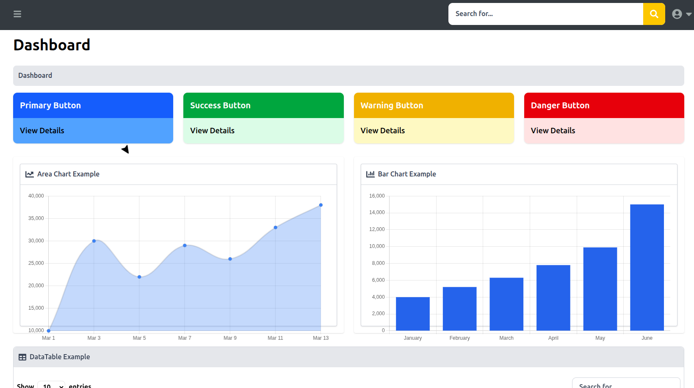
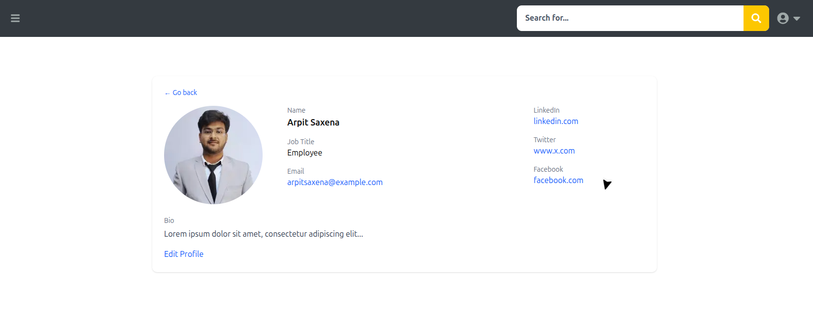
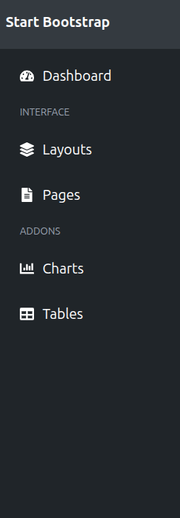

# Week - 3 Summary(Components list and Screenshots)
## Folder structure - 
```
/home/arpitsaxena/Desktop/TSE/Week-3
├── README.md
├── UI_Components_docs.md
├── Capstone Mini Project/
│ ├── .gitignore
│ ├── components.json
│ ├── eslint.config.mjs
│ ├── jsconfig.json
│ ├── next.config.mjs
│ ├── package.json
│ ├── postcss.config.mjs
│ ├── .next/
│ ├── app/
│ │ ├── favicon.ico
│ │ ├── globals.css
│ │ ├── layout.js
│ │ ├── page.js
│ │ ├── about/
│ │ │ └── page.js
│ │ ├── dashboard/
│ │ │ ├── layout.js
│ │ │ ├── page.js
│ │ │ ├── profile/
│ │ │ │ └── page.js
│ │ │ └── users/
│ │ │ └── page.jsx
│ │ └── login/
│ │ └── page.jsx
│ ├── components/
│ │ └── ui/
│ │ ├── AreaChart.jsx
│ │ ├── aurora-text.jsx
│ │ ├── BarChart.jsx
│ │ ├── border-beam.jsx
│ │ ├── button.jsx
│ │ ├── Card.jsx
│ │ ├── Footer.jsx
│ │ ├── Graph.jsx
│ │ ├── hero.jsx
│ │ ├── Input.jsx
│ │ ├── label.jsx
│ │ ├── LoginForm.jsx
│ │ ├── magic-card.jsx
│ │ ├── marquee.jsx
│ │ ├── Navbar.jsx
│ │ ├── particles.jsx
│ │ ├── ProfileDetails.jsx
│ │ ├── Ratings.jsx
│ │ ├── Sidebar.jsx
│ │ ├── smartTable.jsx
│ │ ├── smooth-cursor.jsx
│ │ ├── Table.jsx
│ │ ├── Testimonials.jsx
│ │ ├── text-animate.jsx
│ │ └── typing-animation.jsx
│ ├── lib/
│ │ └── utils.js
│ └── public/
│ ├── file.svg
│ ├── globe.svg
│ ├── myimage.jpg
│ ├── next.svg
│ ├── vercel.svg
│ └── window.svg
├── Screenshots/
│ └── landing-page
```


## Components list - 

- Landing Page -
1. Navbar.jsx — Site navigation bar.
2. Footer.jsx — Site footer.
3. hero.jsx — Top-of-page hero section (headline + CTA).
4. marquee.jsx — Scrolling announcement bar.
5. aurora-text.jsx — Decorative/gradient text used in hero or headings.

- Charts & Visualizations -
1. AreaChart.jsx — Area chart for continuous data.
2. BarChart.jsx — Bar chart for categorical comparisons.
3. Graph.jsx — Generic visualization wrapper/container.

- Data & Tables -
1. Table.jsx — Basic tabular data component.
2. smartTable.jsx — Enhanced table with sorting/filtering/pagination.

- Forms & Authentication -
1. LoginForm.jsx — Login form UI and submit handling.
2. Input.jsx — Form input control with validation support.
3. label.jsx — Small label/badge helper.

- Layout & Navigation Panels -
1. Sidebar.jsx — Collapsible side navigation panel.
2. ProfileDetails.jsx — User profile display (avatar, bio, stats).
3. Card.jsx — Generic card container for grouped content.
4. magic-card.jsx — Stylized interactive card (visual focus).

- Controls & Widgets -
1. button.jsx — Reusable button component.
2. Ratings.jsx — Star/rating display and input.
3. Testimonials.jsx — Carousel/list of user reviews.

- Effects & Animation Utilities -
1. particles.jsx — Background particle animation.
2. smooth-cursor.jsx — Custom smooth-following cursor effect.
3. text-animate.jsx — Text animation helper (transitions).
4. typing-animation.jsx — Typewriter-style text animation.
5. border-beam.jsx — Visual border/glow accent.

## Screenshots - 
### Landing page -


### Dashboard - 


### Profile page - 


### Sidebar - 


### Navbar - 


