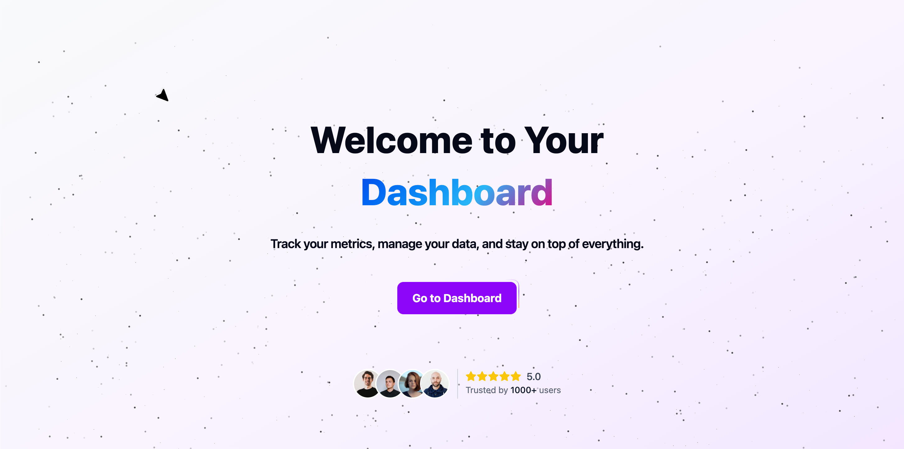

# The below file contains the attachments which shows that the UI is now completely responsive and has various additional components from Magic UI.

## Landing-page:

Also made various components to make the UI more attractive.

## Testimonials and Footer:

## Dashboard:

## Login page:

## Profile page:

## Users page:

---
---

# RESPONSIVENESS:

1. Dimension:Responsive

2. Dimension: 559 * 924

