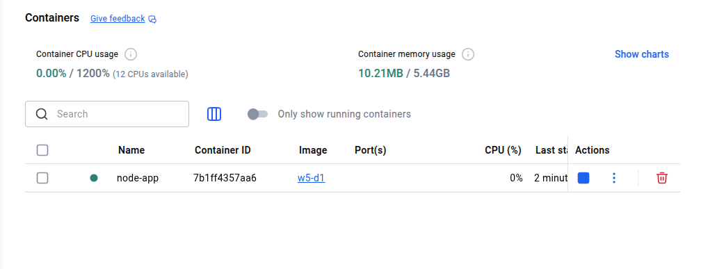
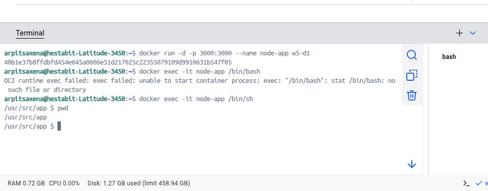
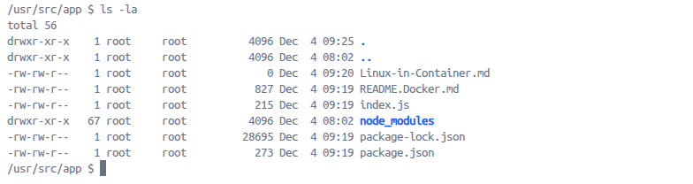
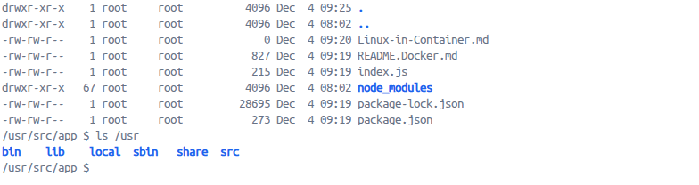
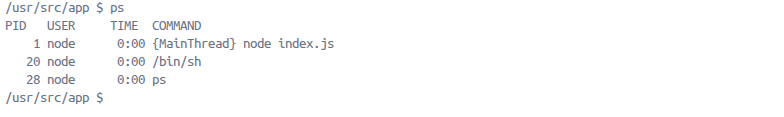
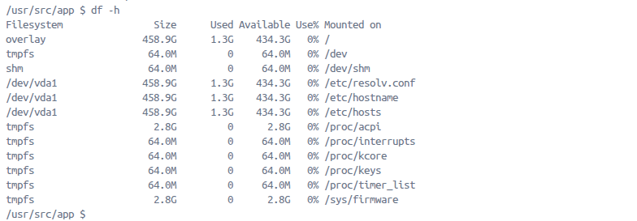
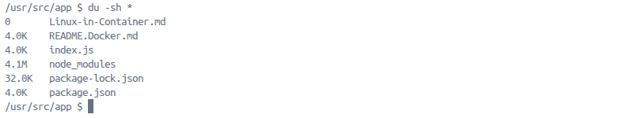
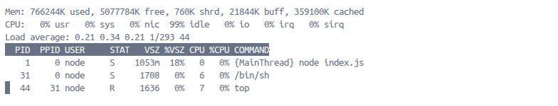
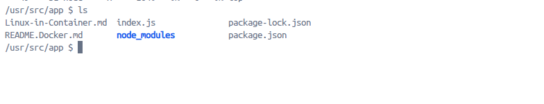
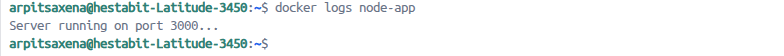

# Day-1 tasks

## Steps to create image in Docker

1. **Initialize Node**
2. **Create `index.js` file**
3. **Run `docker init`**
    - Remember to install Docker Desktop before initializing it in the folder, or else it will raise an error.
    - Upon initializing Docker in the folder, it will ask the following things:
        - Version of Node (select any one)
        - Package manager you want to use (`npm`)
        - Command to start the app (`node index.js`)
        - Which port your server listens on (`3000`)
    - It will create files like:
        - `.dockerignore`
        - `Dockerfile`
        - `compose.yaml`
        - `readme.docker.md`
    - Build the image using:
    ```
    docker build -t "filename" .
    ```

## Container running node app -
- Node app Image in Docker -

- Node app Container in Docker -



**Always map the machine port with container port in order to run the container in the browser.**
```
docker run -d -p 3000:3000 w5-d1
```
## SSH into Container - 
Use the command -
```
docker exec -it node-app /bin/sh
```


## Linux commands in Container -

*Using the `pwd` command* - 

It shows present working directory.

*Using the `ls -la` command* -

It lists files and directories.

*Using the `ls /usr` command* -

It lists the contents of the /usr directory.

*Using the `ps` command* -

It displays all active processes inside the container.

*Using the `df -h` command* -

It shows overall disk space usage.

*Using the `du -sh *` command* -

It is used to see which files or directories are taking up space.

*Using the `top` command* -

It shows CPU, memory usage, and active processes in real time.

*Using the `ls` command* -

It is used to list files and directories.

*Using the `docker logs <container-name>` command* -

It shows the logs.

