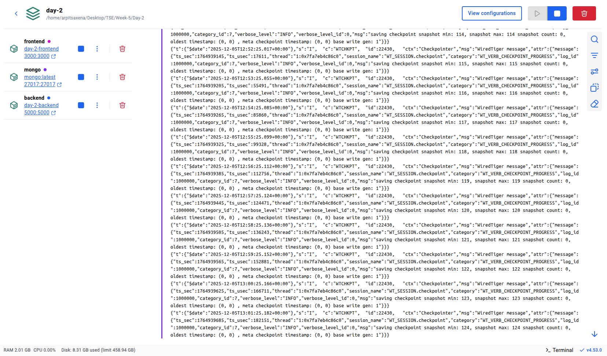

# *Service-Architecture*

## Frontend-creation

1. Create a folder for the project and inside it create a React app using Vite.

2. Vite generates the project structure (src, package.json, config files).

3. Run the development server during development.

4. For deployment, create a Dockerfile that:

    - Builds the React app.

    - Serves it using Nginx inside a container.

## Backend-creation
1. Create a backend folder and initialize a Node.js project.

2. Add dependencies like Express, Mongoose, CORS, and Body-parser.

3. Create server logic:

    - MongoDB connection

    - Task schema/model

    - Routes for GET and POST tasks

4. Create a Dockerfile that:

    - Uses Node base image

    - Installs dependencies

    - Copies backend code

    - Exposes backend port


## Docker Compose — Summary

1. Create a docker-compose.yml at the root.

2. Define three services:

    - frontend (React + Vite build served by Nginx)

    - backend (Node + Express)

    - mongo (Database container)

3. All services run in the same Docker network so they can talk to each other.

4. MongoDB uses a volume so data is saved even if the container is removed.

5. Entire app starts with one command:
`docker compose up -d`

## Service-Architecture

```
                             ┌────────────────────────────────────────┐
                             │              Client Browser            │
                             │  (User interacts with React App UI)    │
                             └───────────────────┬────────────────────┘
                                                 │ HTTP (3000)
                                                 ▼
                                 ┌────────────────────────────────┐
                                 │     Frontend (React + Vite)    │
                                 │ Container: frontend            │
                                 │ Path: ./Frontend/task-app      │
                                 └───────────────┬────────────────┘
                                                 │ API Calls
                                                 │ http://backend:5000
                                                 ▼
                    ┌────────────────────────────────────────────────────────┐
                    │          Backend (Node.js + Express + Mongoose)        │
                    │ Container: backend                                     │
                    │ Exposes: 5000                                          │
                    │ Responsible for: REST API, Validation, Business Rules  │
                    └────────────────────────────┬───────────────────────────┘
                                                 │ MongoDB Driver
                                                 │ mongodb://mongo:27017/taskdb
                                                 ▼
                  ┌────────────────────────────────────────────────────────────┐
                  │                       MongoDB Database                     │
                  │ Container: mongo                                           │
                  │ Stores: tasks collection                                   │
                  │ Data persisted via volume: mongo-data:/data/db             │
                  └────────────────────────────────────────────────────────────┘
```


## Running Container Image -
