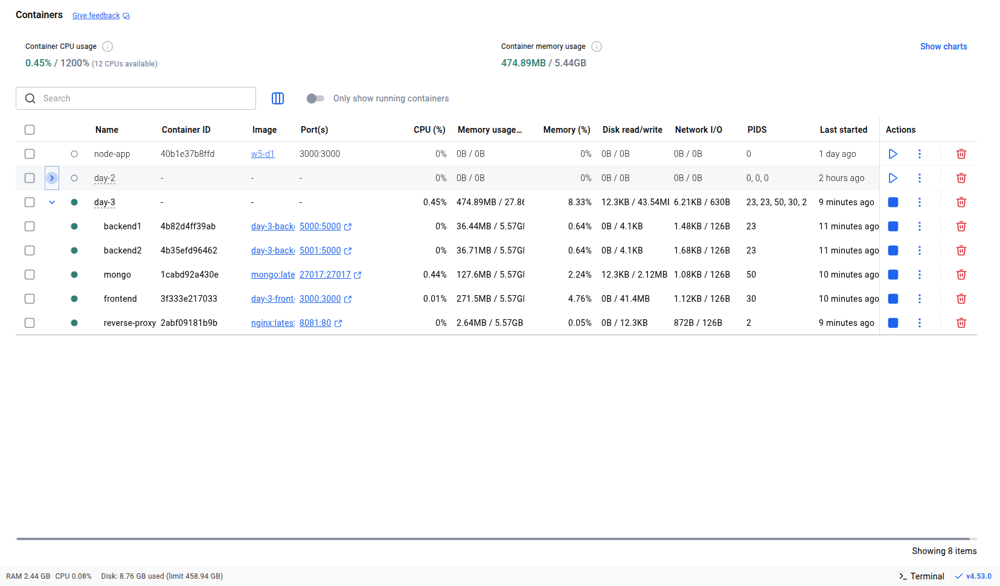

# NGINX Reverse Proxy + Load Balancing with Docker

- Create two backend replicas in the `docker-compose.yaml` file.
- Make use of upstream which is a directive used to define a group of backend servers that NGINX can proxy requests to. It’s the core of NGINX load balancing. It uses round-robin configuration as default.

## Running Container Image with reverse-proxy and load-balancing -
