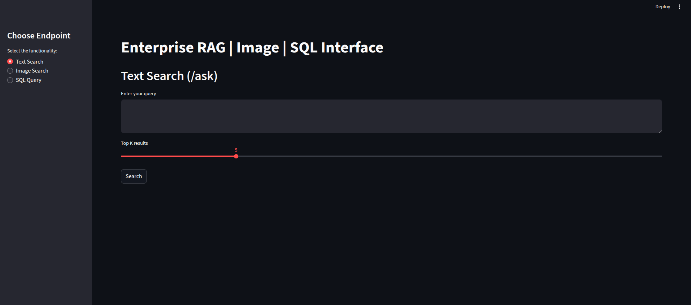
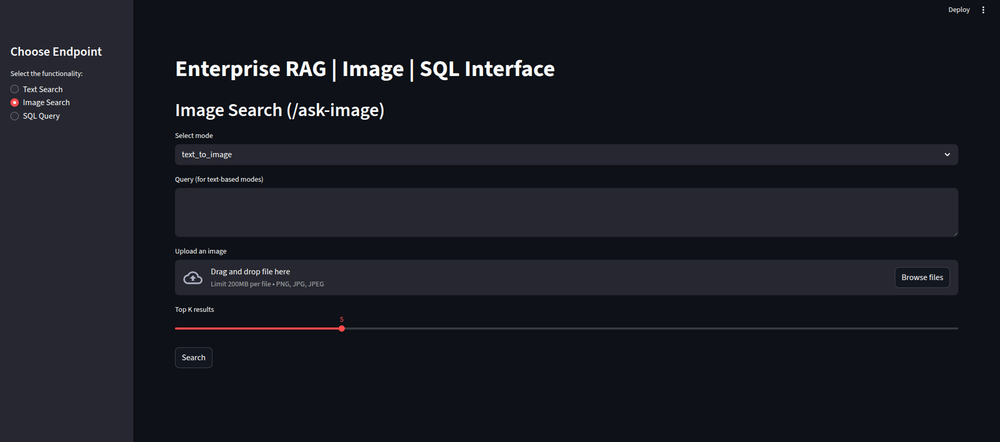
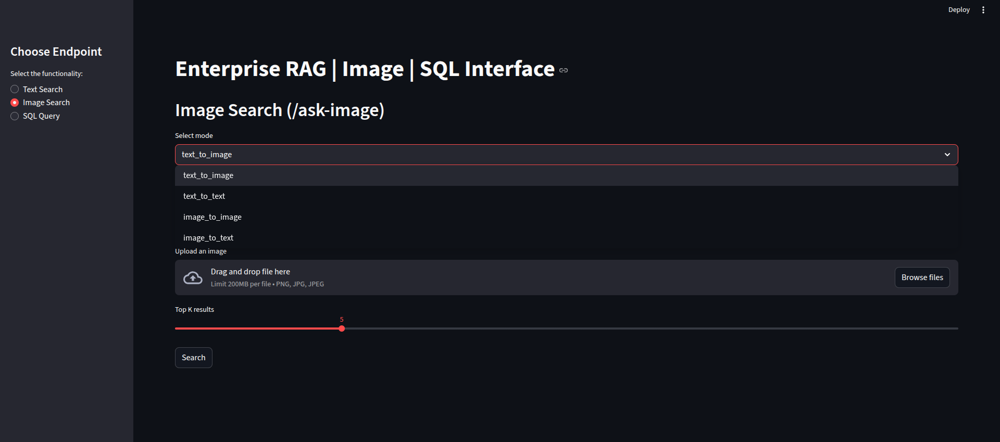
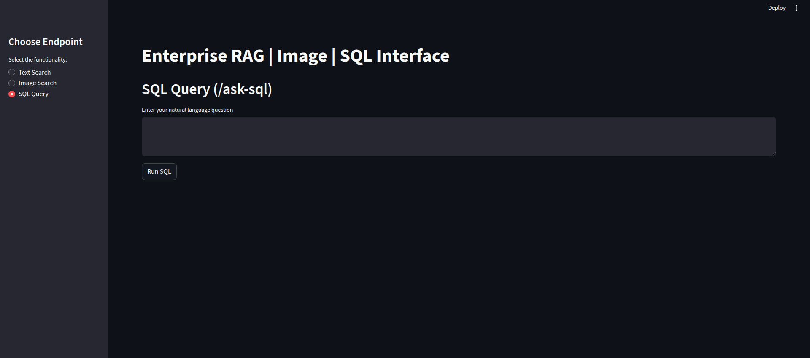

# Deployment Notes

Deployment guide for the Enterprise RAG system.

# Install dependencies
pip install fastapi uvicorn streamlit
pip install torch transformers sentence-transformers
pip install faiss-cpu pillow pytesseract
pip install langchain-community ragas datasets
pip install requests pydantic

# Install Tesseract OCR
sudo apt-get install tesseract-ocr  # Ubuntu


## Data Setup
```
All the below files must exist:
    src/data/
    pipelines/injest.py
    embeddings/embedder.py
    vectorstore/index.faiss
    data.app.db

```

# Starting the app
```
uvicorn src.deployment.main:app --host 0.0.0.0 --port 8000 --reload
```

### Start Frontend
```
streamlit run app.py --server.port 8501
```

Access UI at: **http://localhost:8501**

## API Endpoints

**Base URL**: `http://localhost:8000`

### 1. Health Check
```bash
curl http://localhost:8000/
```

### 2. Text Search
```
 POST http://localhost:8000/ask
```

### 3. Image Search
```
# Text to image, image to Text, Text to Text and Image to Image
POST http://localhost:8000/ask-image

 - requires mode, query and top_k value.

```

### 4. SQL Query
```
POST http://localhost:8000/ask-sql
 - requires query and type.
```

## Configuration

### Environment Variables
```
DB_PATH=data/app.db
HF_HOME=/path/to/models
API_PORT=8000
LOG_LEVEL=INFO
```

### Attachments
1. Text-search
    
2. Image-search
    
    - All conversion types :-
    
3. SQL-search
    